<div align="center">

# AUREON
### Agentic Career Intelligence Platform

**EVIDENCE BEFORE DIRECTION**

*Career guidance ends where the real decision begins.*

[](https://sathvika281.github.io/AUREON_TAKEOVER_PROJECT/)
[](docs/ARCHITECTURE.md)
[](#validation--engineering-proof)
[](#)

[Live Demo](https://sathvika281.github.io/AUREON_TAKEOVER_PROJECT/) ·
[Architecture](docs/ARCHITECTURE.md) ·
[Agentic Architecture](docs/AGENTIC_ARCHITECTURE.md) ·
[Local Setup](#local-setup)

</div>

---

## What is Aureon?

Most students are asked to choose a career before they've had the chance
to discover one. Aureon is a Career Intelligence Platform built on one
structural conviction: **a career decision is only as good as the
evidence behind it.** Instead of a ten-question quiz producing a static
verdict, Aureon builds a persistent, evolving, evidence-backed model of
who a student actually is — through real conversation, hands-on projects,
reflection, and honest exploration — and carries that model through a
connected journey: **Discover → Explore → Connect → Decide.**

Every candidate career it surfaces, every confidence label it shows, and
every "you're ready to decide" signal traces back to specific evidence.
Nothing is guessed. Nothing is fabricated — and where something isn't
built yet, this document says so explicitly.

## The Problem

Career guidance, as most students experience it, fails in five compounding
ways: **limited self-awareness** (asked to choose before being given
tools to understand themselves), **fragmentation** (a quiz here, a
counselor there, nothing connecting them), **one-shot recommendations**
(a static result from a static snapshot, with no memory of growth since),
**incomplete, socially-biased information** (choosing what's visible
nearby, not what genuinely fits), and **no chance to experience a career
before committing years toward it.**

## Why Existing Career Guidance Falls Short

| Category | What it genuinely solves | Where it stops |
|---|---|---|
| Professional networks | Visibility, job listings | Assumes you already know your direction |
| Opportunity-discovery platforms | Surfacing competitions/opportunities | Doesn't explain *why* a student is suited to them |
| Learning platforms | Structured courses, certification | Assumes you already know what to learn *toward* |
| School counseling | Real human judgment | Doesn't scale past a handful of students; one-time snapshot |
| Career quiz sites | A fast, low-friction start | Single-shot, static — never improves as the platform learns more |

Every one of these answers *"what career should I choose"* from a single,
narrow signal. Aureon starts one level earlier: **who am I, genuinely** —
and keeps answering that question as the student changes.

## Aureon's Core Idea

```
TRADITIONAL          Student → Quiz/Test → Recommendation → Static List

AUREON                Student → Discover → Explore → Connect → Decide
                                    ↑___________evidence loop___________↓
```

This is a loop, not a funnel. A student who reaches Decide and needs more
evidence is routed back to Explore or Connect — the evidence they gather
there flows straight back into the decision they're working toward.
Career development is treated as an evolving, evidence-driven process,
never a one-time prediction.

## Student Journey

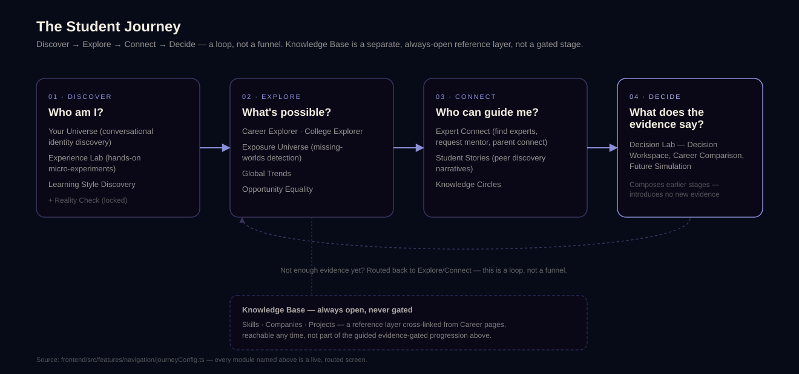

| Stage | Answers | Real features |
|---|---|---|
| **Discover** | Who am I? | Your Universe (conversational identity discovery), Experience Lab, Learning Style Discovery |
| **Explore** | What's possible? | Career Explorer, College Explorer, Global Trends, Exposure Universe, Opportunity Equality |
| **Knowledge Base** *(always open)* | What exists? | Skills, Companies, Projects — an ungated reference layer, not part of the guided progression |
| **Connect** | Who can guide me? | Expert Connect, Student Stories, Knowledge Circles |
| **Decide** | What does the evidence say? | Decision Lab — Decision Workspace, Career Comparison, Future Simulation |

Full write-up, per-stage data flow: [`docs/PRODUCT_FLOW.md`](docs/PRODUCT_FLOW.md)

## Agentic Architecture

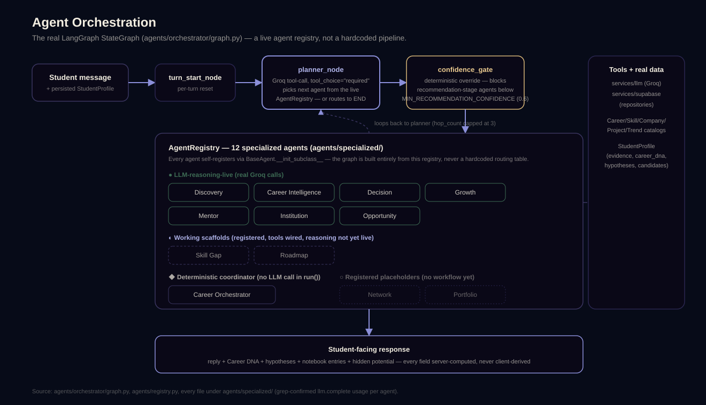

A real LangGraph `StateGraph` — not a hardcoded pipeline. Every turn:
`turn_start → planner (Groq tool-call) → confidence_gate (deterministic
safety floor) → routed agent → back to planner`, capped at 3 hops per
turn. **12 agents are registered; 7 are genuinely LLM-reasoning-live
today** (Discovery, Career Intelligence, Decision, Mentor, Institution,
Growth, Opportunity), 2 are working scaffolds, 1 is a deterministic
non-LLM coordinator, and 2 are honest, unimplemented placeholders. Full
breakdown, with the exact status of every agent: [`docs/AGENTIC_ARCHITECTURE.md`](docs/AGENTIC_ARCHITECTURE.md)

**A structural safeguard worth naming directly:** confidence is bounded
in code, not just requested through a prompt — a deterministic ceiling
ties how confidently the system can speak to how much real evidence
exists, so the platform is structurally incapable of recommending a
career after a handful of exchanges, regardless of what an LLM might
otherwise be persuaded to say.

## Knowledge Graph

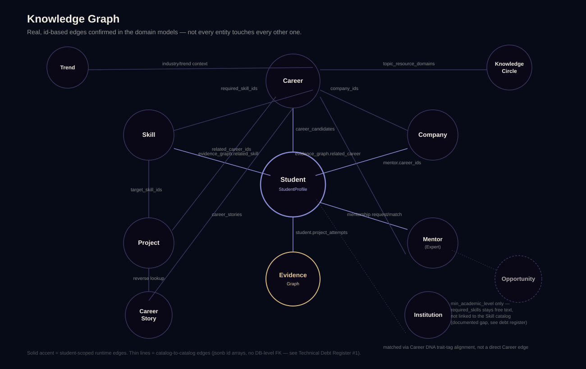

Career, Skill, Company, Project, Mentor, Institution, Trend, and Student
Story are real, connected entities — not isolated catalogs. A student
exploring a career sees the skills it actually requires, the companies
that hire for it, the projects that build toward it, and the real experts
who've walked it. Every edge shown is a real id-based relationship
confirmed in the domain models — including being explicit about the one
relationship that deliberately **doesn't** exist yet (Opportunity ↔ Skill,
a documented, evidence-checked gap, not an oversight). Full entity-by-
entity breakdown: [`docs/KNOWLEDGE_GRAPH.md`](docs/KNOWLEDGE_GRAPH.md)

## Evidence Loop

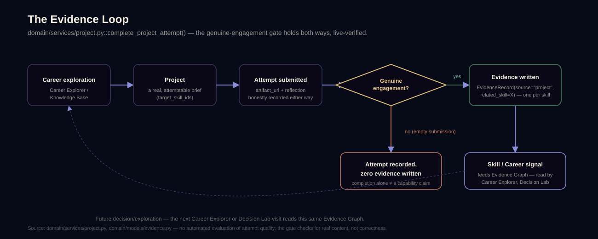

Career exploration → a real Project brief → an attempt → a **genuine-
engagement gate** → evidence written (or honestly withheld) → a Skill/
Career signal any future Career Explorer or Decision Lab visit can read.
Completing a project with real content writes real, skill-tagged evidence;
an empty completion is still honestly recorded as an attempt, but
contributes nothing to the Evidence Graph — "the student clicked a
button" is never treated as proof of capability. Full mechanics:
[`docs/EVIDENCE_ENGINE.md`](docs/EVIDENCE_ENGINE.md)

## What We've Built

Sprints 1-5 are **live in production** today (GitHub Pages + Render).
Sprints 6-11 — account self-service (signup, login, password recovery,
profile editing, password change), state-integrity fixes, design-system
consolidation, and onboarding/profile continuity — are complete, tested,
and committed locally; release is handled as a separate, deliberate step,
not bundled into this documentation pass.

## Key Product Capabilities

- **Your Universe** — a literal, explorable identity-discovery space:
  every piece of real evidence becomes a visible signal, not an abstract
  score.
- **Career Explorer** — real day-to-day realities (salary, stress,
  automation risk), personalized candidates with cited supporting *and*
  contradicting evidence.
- **Decision Lab** — Decision Confidence ("does this fit") and Decision
  Progress ("have you actually done the work to know") kept deliberately
  separate — a student can have high confidence and low progress, and the
  product says so.
- **Expert Connect** — real expert matching against Career DNA, with a
  full request → pending → accepted mentorship lifecycle.
- **Opportunity Equality** — internships and scholarships ranked by how
  unlikely a student would have been to find them unassisted, not by
  popularity.
- **Knowledge Base** — Skills, Companies, and Projects as an always-open
  reference layer, cross-linked from every Career page.

## Technology Stack

| Layer | Technology |
|---|---|
| **Frontend** | React 18 · TypeScript · Vite · Tailwind CSS · React Router 7 · Framer Motion |
| **Backend** | Python · FastAPI · Pydantic v2 |
| **Agent Orchestration** | LangGraph (`StateGraph`) · a live, self-registering agent registry |
| **LLM** | Groq (`llama-3.3-70b-versatile`) — the sole provider; confirmed zero OpenAI/Anthropic SDK usage |
| **Database** | PostgreSQL via Supabase (31 forward-only migrations, repository pattern, no ORM) |
| **Authentication** | Supabase Auth (email + password) |
| **Testing** | pytest + pytest-asyncio (backend); Playwright-driven live walkthroughs (frontend, no persisted framework — a disclosed choice, not a gap) |
| **Deployment** | GitHub Pages (frontend) · Render (backend) |

Confirmed absent, on purpose: SQLAlchemy/ORM, a vector database or
embeddings (career/story matching uses deterministic tag-overlap and LLM
reasoning), Supabase Storage.

## Trust / Responsible AI

Every claim below is grounded directly in code or verified behavior —
see [`docs/SECURITY.md`](docs/SECURITY.md) and [`docs/DECISIONS.md`](docs/DECISIONS.md)
for the full reasoning behind each.

- **Honest empty and error states, always distinct.** Loading, success,
  genuine-empty, and error are never collapsed into one silent state — a
  real bug this discipline caught: a missing migration once made a fully-
  seeded feature 500 on every request, silently disguised as an honest-
  looking empty catalog by looser error handling. Fixed, and now
  regression-guarded.
- **Genuine engagement required for evidence.** A Project completion with
  no real content writes zero evidence — see the Evidence Loop above.
- **Student-scoped access, enforced and live-verified.** Every student-
  scoped route rejects a mismatched `student_id` with `403`, confirmed via
  real HTTP calls against the running backend, not just reasoned about.
- **No forced recommendation below the confidence floor.** A deterministic
  gate, not a prompt instruction, blocks recommendation-stage agents when
  evidence is too thin — confirmed in code (`agents/confidence_gate.py`).
- **External links are not fabricated.** A dedicated audit found and
  removed 46 fake placeholder URLs from seed data; a permanent test now
  guards against the same mistake recurring.
- **Illustrative personas are labeled, never presented as real people.**
  Human Stories are authored composite journeys (e.g. "Data Scientist, 6
  years experience"), explicitly not fabricated named individuals.
- **No password ever stored in Aureon's own database** — Supabase Auth
  owns credentials entirely.

## Validation / Engineering Proof

- **811 backend tests passing** (`pytest`), covering agent self-
  registration, orchestrator graph compilation, the confidence gate,
  every domain service, and route-level authorization — via
  `FakeLLMClient`/fake-Supabase test doubles, zero network calls in the
  suite.
- **Live-verified, not just unit-tested.** Every feature area has been
  driven end-to-end against the real Groq + Supabase stack via headless-
  Chromium (Playwright) walkthroughs, using ephemeral test accounts
  created and deleted per session.
- **Cross-account authorization verified live**: a second account's token
  against a first account's data returns `403` in practice.
- **Project evidence persistence verified live**: a genuine completion
  writes exactly one evidence record per target skill; an empty one
  writes zero, both confirmed through the real HTTP layer.
- **Current verified dataset** (queried live from the running backend,
  not a stale seed-script estimate):

  | Careers | Skills | Companies | Projects | Experts | Institutions | Trends | Knowledge Circles | Student Stories |
  |---|---|---|---|---|---|---|---|---|
  | 27 | 23 | 31 | 20 | 116 | 9 | 16 | 31 | 54 |

  *These are current catalog/content counts, not user or impact metrics —
  Aureon does not have production users to report numbers about.*

## Screenshots

All screenshots below are real captures from the running application
(a seeded demo account with genuine onboarding, conversation, and project
evidence — not mocked UI states).

| | |
|---|---|
| 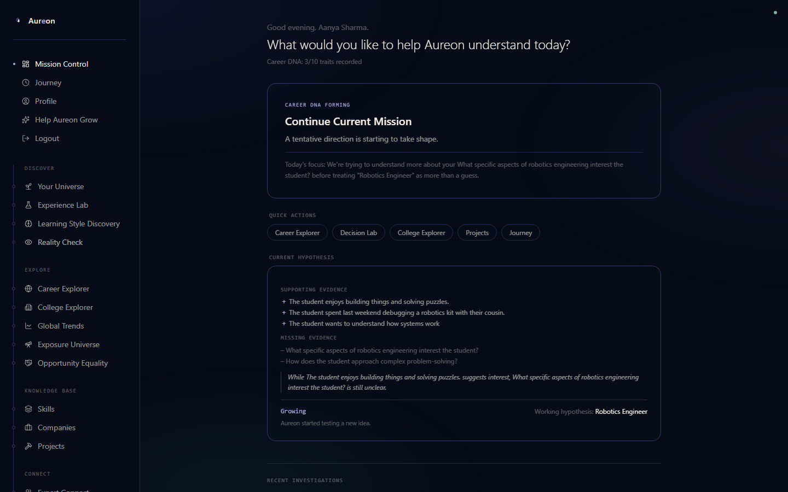 **Mission Control** — the student's real-time dashboard: Career DNA progress, the current hypothesis with cited supporting/missing evidence, and quick actions into every stage. | 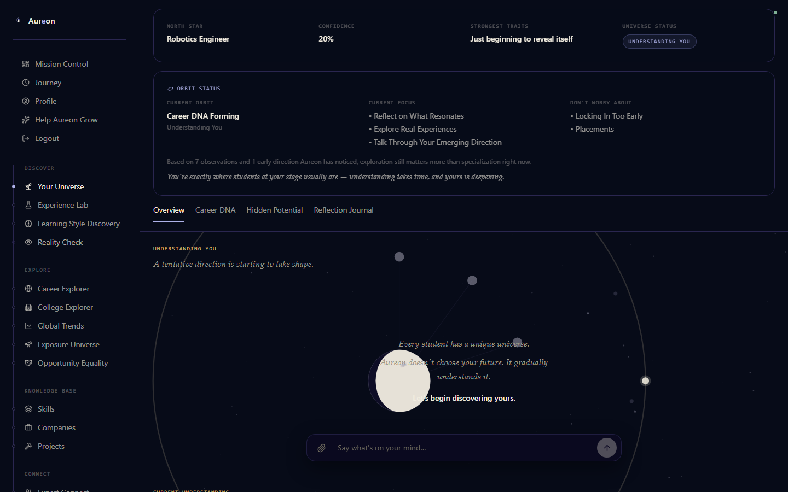 **Your Universe** — the conversational identity-discovery space, with North Star, live confidence, and Orbit Status all computed from real accumulated evidence. |
| 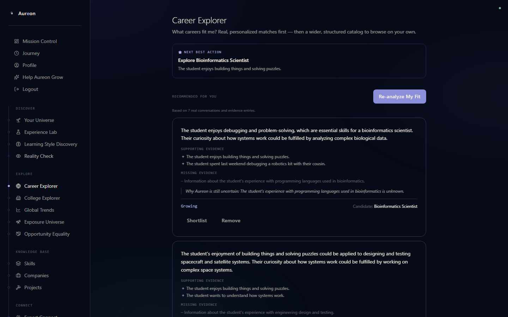 **Career Explorer** — personalized career candidates, each with real cited supporting evidence and honestly-named missing evidence. | 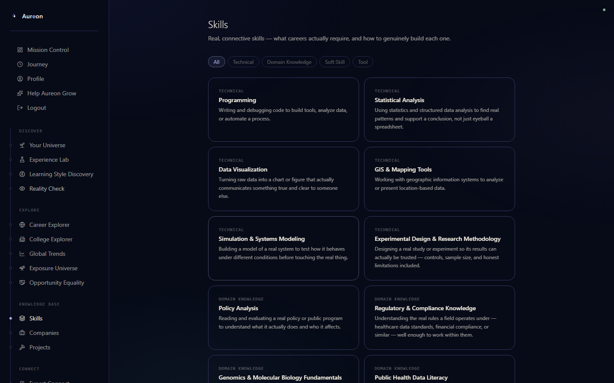 **Knowledge Base — Skills** — the always-open, ungated reference catalog. |
| 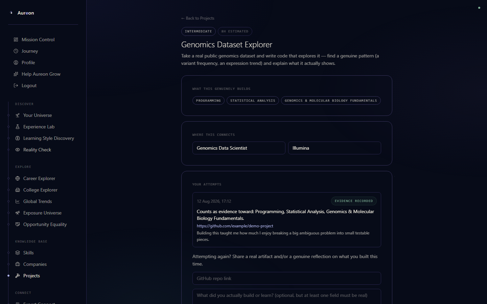 **Project detail** — a real attempt with a submitted artifact and reflection, and the exact skills it counts as evidence toward. | 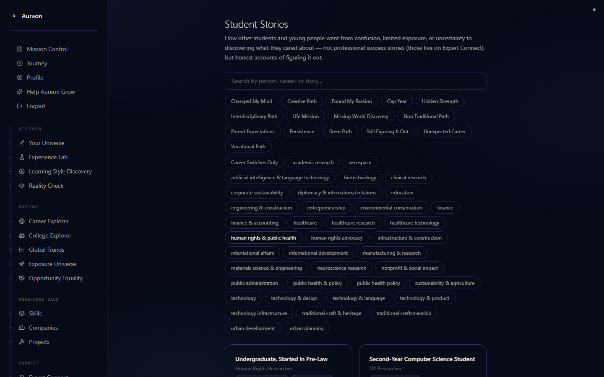 **Student Stories** — real discovery narratives, filterable by theme and topic. |
| 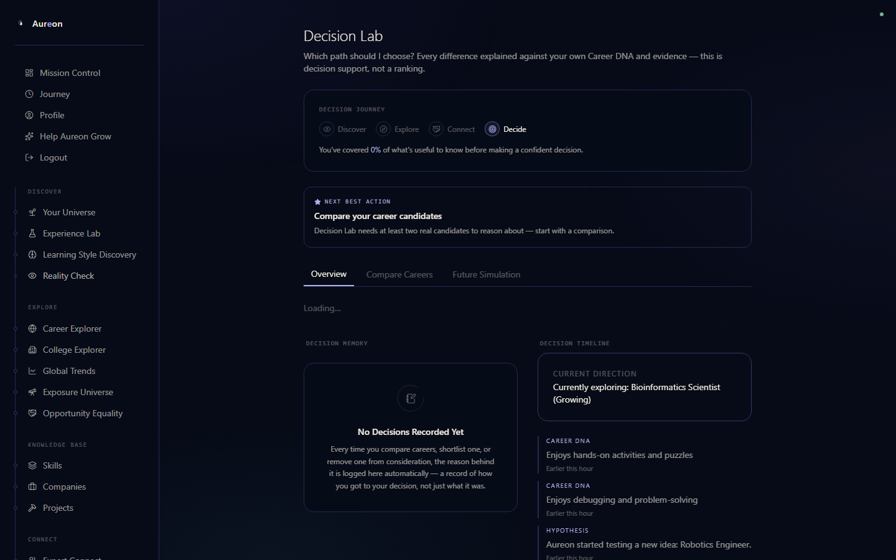 **Decision Lab** — Decision Journey progress, Next Best Action, Decision Memory, and a real Decision Timeline composed from Career DNA and hypothesis events. | 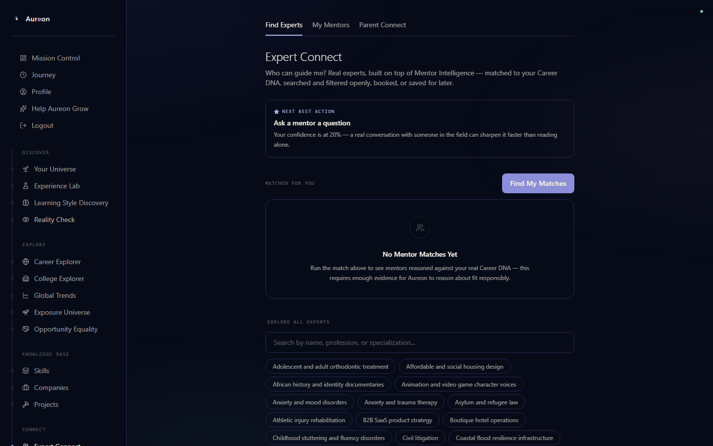 **Expert Connect** — real expert matching entry point, with Find Experts / My Mentors / Parent Connect as one destination. |

## Architecture Diagrams

| Diagram | What it shows |
|---|---|
| [Student Journey](docs/diagrams/student-journey.svg) | The four guided stages + the ungated Knowledge Base |
| [Agent Orchestration](docs/diagrams/agent-orchestration.svg) | The real LangGraph routing loop and the honest 12-agent registry |
| [Knowledge Graph](docs/diagrams/knowledge-graph.svg) | Confirmed entity relationships, including the one that doesn't exist yet |
| [Evidence Loop](docs/diagrams/evidence-loop.svg) | The genuine-engagement gate, both branches |
| [System Architecture](docs/diagrams/system-architecture.svg) | Frontend → API → domain → agents → data, plus deployment |

Deeper documentation: [`docs/ARCHITECTURE.md`](docs/ARCHITECTURE.md) ·
[`docs/PRODUCT_FLOW.md`](docs/PRODUCT_FLOW.md) ·
[`docs/AGENTIC_ARCHITECTURE.md`](docs/AGENTIC_ARCHITECTURE.md) ·
[`docs/KNOWLEDGE_GRAPH.md`](docs/KNOWLEDGE_GRAPH.md) ·
[`docs/EVIDENCE_ENGINE.md`](docs/EVIDENCE_ENGINE.md) ·
[`docs/SECURITY.md`](docs/SECURITY.md) ·
[`docs/DECISIONS.md`](docs/DECISIONS.md)

## Local Setup

**Prerequisites:** Python 3.11+, Node.js 20+, a Supabase project (URL +
keys), a Groq API key.

### Backend

```bash
cd backend
python -m venv .venv
.venv/Scripts/activate        # Windows; `source .venv/bin/activate` on macOS/Linux
pip install -e ".[dev]"
cp .env.example .env          # fill in real Supabase/Groq credentials — never commit this file
```

Apply the 31 migrations under `backend/db/migrations/` in order via your
Supabase project's SQL Editor (Project → SQL Editor → New query → paste →
Run) — no migration tool is wired up yet (see
[`docs/ARCHITECTURE.md`](docs/ARCHITECTURE.md)).

```bash
uvicorn aureon.main:app --reload
```

- API: http://localhost:8000 · Health check: `/health`
- Tests: `pytest`

### Frontend

```bash
cd frontend
npm install
cp .env.example .env          # VITE_API_BASE_URL, VITE_SUPABASE_URL, VITE_SUPABASE_ANON_KEY
npm run dev
```

- App: http://localhost:5173
- Production build: `npm run build` · GitHub Pages build: `npm run build:gh-pages`

**Never commit:** real API keys, Supabase service-role keys, passwords,
or tokens. Only `.env.example` files (placeholder values) are tracked;
`.env` is git-ignored everywhere in this repo.

## Production Links

- **Live demo (frontend):** https://sathvika281.github.io/AUREON_TAKEOVER_PROJECT/
- **Backend:** deployed via Render (`render.yaml`); the live URL is
  environment-specific and injected into the frontend build at deploy
  time, not hardcoded in this repository.

## Future Scope

Named explicitly as **not yet implemented**, per this repository's own
truthfulness discipline — see [`docs/AGENTIC_ARCHITECTURE.md`](docs/AGENTIC_ARCHITECTURE.md)
and the [Technical Debt Register](docs/TECHNICAL_DEBT_REGISTER.md) for
the full detail behind each:

- **Skill Gap and Roadmap agents** — registered, with real descriptions,
  but not yet LLM-reasoning-live in the orchestration graph.
- **Network and Portfolio agents** — registered placeholders for a future
  facade over mentor/institution matching and GitHub/document-based
  evidence extraction.
- **Opportunity ↔ Skill catalog linkage** — currently free text on
  Opportunity, not yet promoted to the real Skill catalog (a checked,
  documented gap: 0 of 33 real strings currently overlap).
- **A real migration/CI pipeline** — schema changes are still applied by
  hand via the Supabase SQL Editor; flagged as the one item that must
  change before a real production launch.
- **Deeper career-world breadth and specialized domain intelligence**
  (medicine, law, arts, trades, and more, reasoned through the same
  Career Orchestrator rather than a separate system) and **career-
  switching intelligence** for transitions later in life — both real
  product direction, not yet built.

---

<div align="center">

Built for **LT HackFest 2026**.

</div>
