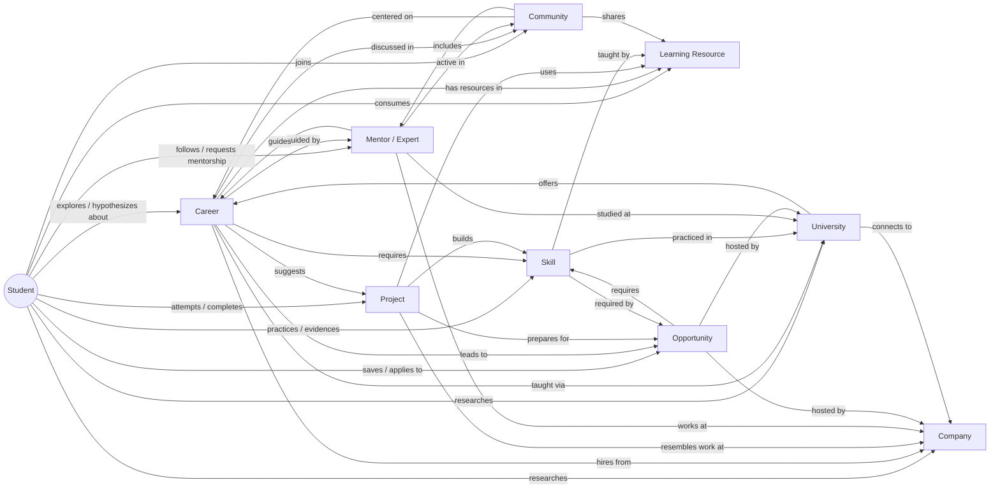

# Aureon Knowledge Model — Data Architecture (v2: Data + Product + Information Design)

**Status:** conceptual design, pre-schema. Still no SQL/tables by intent — this version adds how each entity is *experienced*, not just stored, because a knowledge graph that's well-designed on paper and dumped onto a page as an unstructured list of facts still reads as a student project. The test for every section below: **if I removed the frontend and only looked at this knowledge model, would I believe this is the backend of a production startup?**

## 0. Where this starts from

Unchanged from v1 — worth restating because it's still the load-bearing fact: `Career`, `Mentor` ("Expert"), `Institution` ("University"), `Opportunity`, and `KnowledgeCircle` ("Community") already exist, already have 20-100+ real fields, and already carry an honest "illustrative composite, clearly labeled" content discipline. **Skill, Company, and Project don't exist as entities** — they're free-text strings duplicated across a dozen models. **Student is a 30-field accumulation ledger, not a graph hub.** Everything below extends the first four, promotes the missing three, and restructures the last one.

## 0.1 Shared vocabulary (defined once, referenced everywhere below)

Repeating full definitions in every entity section would itself look like padding — a mature design system states its primitives once and reuses them by name. These four apply to every entity that follows.

**Visual system** — reuse Aureon's existing tokens, introduce nothing new: canvas `#070B18`, raised surface `#0A0817`, borders `#2A2650`/`#3A3560`, ink `#F2EDE0` (with muted/faint opacity steps for hierarchy), accent `#8B8FD9`/`#AEB2E8` for anything interactive, **gold reserved for achievement/completion only**, **success green for status only**, **danger only for real errors**. If a new entity page needs a new color to feel "finished," that's a signal the layout is under-designed, not that the palette is incomplete.

**Information hierarchy pattern** — every entity page follows the same three-tier disclosure, so the *pattern* becomes familiar across the whole product even though the content differs:
- **Primary** (above the fold, no interaction required): the one or two facts that answer "is this relevant to me" in under three seconds.
- **Secondary** (one scroll, grouped under clear headers): the facts a genuinely interested user reads next.
- **Tertiary** (collapsed, tabbed, or reached by explicit click): depth for someone who's already committed — FAQs, full timelines, raw evidence lists.

**Trust vocabulary** — the same small, consistent set of signals recurs on every entity rather than each page inventing its own way to seem credible: a source/provenance label (`Illustrative composite` / `Verified` / `Partner` / a real external citation), evidence tiers stated as *Emerging / Growing / Strong* — never a raw invented percentage, relative "last updated" timestamps, and sparse, real badges (`is_partner`, `accepts_mentorship`) never inflated. Explicitly excluded, everywhere: fabricated urgency ("12 students viewing this now"), fake scarcity, invented review counts. Those don't just fail an honesty test — they read as fake *faster* than an empty state does, because a sophisticated user recognizes the pattern immediately.

**No dead ends** — every entity page ends in a cross-link rail, not a full stop. The specific chains requested (`Career → Skills → Projects → Companies → Mentors → Opportunities → Resources → Communities → Related Careers`, `Skill → Careers → Projects → Resources → Companies → Opportunities`, `Company → Careers → Mentors → Opportunities → Skills → Projects`) are implemented literally below as each entity's closing section.

## 1. The knowledge graph, at a glance

Every entity is reachable from Student in at most two hops, and every entity connects to at least three others. Nothing is an island — and, per the addition in this version, nothing is a page you can land on and then have nowhere else to go.

---

## 2. Student

### Purpose
The hub — the accumulated, evidence-backed record of who this person is becoming. This is what the "Career Digital Twin" framing actually refers to. Not a settings page; the thing every recommendation traces back to.

### Core Fields
`display_name`, `stage` (routing signal only, **never shown to the student as a label**), `confidence_score`, `career_dna_summary` (derived view of `CareerDNA`, not duplicated storage), `active_hypotheses`, `onboarding_completed_at`, `last_active_at` (powers the return-visit hook), `locale`/`parent_accessible`, `avatar_seed` (deterministic, generated — never a real photo requirement for a minor). Everything else currently on `StudentProfile` (evidence graph, reflections, exploration history, comparisons, notebook entries) survives exactly as valuable — it becomes edges and evidence *feeding* this thin core, not fields *on* it.

### Relationships
`has_skill_evidence→Skill`, `hypothesizes_about→Career`, `attempted→Project`, `requested_mentorship_from→Mentor`, `member_of→Community`, `saved/applied_to→Opportunity`, `researched→University`, `researched→Company`.

### User Actions
Explore, reflect, attempt an experiment/project, request a mentor, save an opportunity, join a community, export a report, revise or discard a hypothesis, manually override the inferred stage (self-report must always be able to correct the system — this is a trust requirement, not a nice-to-have).

### Metadata
`created_at`, `last_active_at`, a data-completeness indicator (so the UI can honestly say "still learning about you" instead of faking confidence), consent/parent-visibility flags.

### External Data Sources
None — intentionally the one entity with zero external dependency. It's what everything else gets matched *against*.

### UI Representation
There isn't one "Student page" — there are two distinct facets, and conflating them is a real design trap:
- **Your Universe** (already built): the *living, exploratory* view — the Moon/star visualization, evidence-explainable on hover, meant to be visited often and to feel alive.
- **My Aureon / Profile Summary** (new, needed): the *resolved, shareable, exportable* view — a calm, linear document: current stage narrative in one paragraph, top 3 emerging hypotheses with their real evidence, a skill summary grouped by tier, active project/experiment, saved opportunities, mentorship status. This is the screen the "download my career report" PDF gets generated from, and the one a parent or counselor would actually want to see instead of the live visualization.

Don't build a third, competing "dashboard" — these two views (living exploration + resolved summary) cover every real use case.

### Information Hierarchy
Primary: current stage narrative + confidence, in plain language, one paragraph. Secondary: top hypotheses, top skills, recent activity. Tertiary (collapsed): full evidence graph, full history, full notebook — reachable, never dumped.

### Recommended Visual Assets
The Moon-phase system already *is* the identity — resist adding a second, competing avatar/photo system. On the summary/export view, skill tiers get a small filled-bar or dot-progression treatment (Emerging = one dot, Growing = two, Strong = three) rather than a percentage bar, to stay consistent with "never a raw invented number."

### Trust Signals
Explicit data-completeness framing ("Aureon has gathered X pieces of evidence about you so far") rather than presenting a thin profile as if it were complete. Every hypothesis and skill reading links back to its real evidence — this is already built for hypotheses (`StarExplainPanel`) and needs to extend to the skill summary view.

### Future Scalability
Edge-based design means new relationship types (a future "alumni" stage post-graduation, a future counselor-shared view) are additive edges, not schema rewrites. Locale field already anticipates the multi-language work already shipped for Parent Connect extending further.

---

## 3. Skill

### Purpose
The connective tissue currently missing. Turns "I did a project" into "I can prove I know React," and lets Career/Opportunity/Project/Resource agree on one vocabulary instead of five spellings of "machine learning."

### Core Fields
`name`, `category` (technical / domain-knowledge / soft-skill / tool), `description` (one or two honest sentences of what *having* it means to do), `parent_skill_id` (optional nesting — React under Frontend Development, without forcing a rigid taxonomy everywhere), `related_skill_ids`, `evidence_types_that_count` (what actually counts as proof — carries forward the existing evidence-honesty discipline: a skill is never "acquired" just because a student said so in chat).

### Relationships
`required_by→Career`, `required_by/preferred_by→Opportunity`, `built_by→Project`, `taught_by→Learning Resource`, `taught_in→University`, `practiced_by→Mentor`.

### User Actions
Browse by category, see "what can I build with this," see a student's own real evidence toward it (tier + citations, never a raw percentage).

### Metadata
`created_at`, `is_canonical` (vs. an alias later merged into a canonical entry — taxonomies always accumulate duplicates; plan the merge path from day one).

### External Data Sources
**O*NET Web Services** (free, U.S. government, real skill-to-occupation mappings). **ESCO** (EU taxonomy, multilingual, strong non-U.S. complement). GitHub's own language/topic taxonomy (already integrated via GitHub Investigation) for real technical-skill evidence.

### UI Representation
- **Hero:** skill name, category badge, one-line definition — no hero image, this entity doesn't need one and forcing a stock photo here is exactly the kind of "placeholder feeling" to avoid.
- **Where it shows up:** careers that require it, projects that build it — two short lists, not two long ones (cap and link to "see all").
- **How to build it:** learning resources, genuinely ordered beginner → advanced, not alphabetical.
- **Who values it:** companies known for it, real open opportunities requiring it.
- **Your evidence:** personalized, only shown when signed in and only when real evidence exists — otherwise this section simply doesn't render, rather than showing an empty "0%" state.
- **Related skills:** closing cross-link rail.

### Information Hierarchy
Primary: name, category, one-line meaning. Secondary: where it's used (careers/projects), how to build it. Tertiary: full resource list, related-skill graph, personal evidence detail.

### Recommended Visual Assets
Category-level iconography only (wrench / book / person / puzzle-piece for tool/domain-knowledge/soft-skill/technical) — a bespoke icon per skill is a maintenance trap at any real scale and buys nothing a consistent category icon doesn't already deliver.

### Trust Signals
The evidence-types-that-count field surfaces directly in copy ("proof: a completed project, a real certificate, or a mentor's real observation — not a claim in chat") — stating the honesty rule out loud is itself a trust signal, not just an internal policy.

### Future Scalability
Merge tooling for canonical/alias skills needs to exist before the catalog grows past a few hundred entries — designing `is_canonical` in from the start avoids a painful later migration. Room for a future "verified assessment" partner integration (e.g. a real coding-test provider) without changing the shape — it would just become a new `evidence_type`.

---

## 4. Project

### Purpose
Distinct from `Experiment`, which stays exactly as it is (short, low-commitment, self-discovery — "does this feel like you?"). Project answers "can you actually do this?" — a real build, a real artifact, honestly portfolio-worthy. Experiment serves the Lost/Explorer stages; Project serves Goal-Oriented execution — the entity split maps directly onto the three-persona model.

### Core Fields
`title`, `brief` (concrete enough to start today), `difficulty_level`, `estimated_hours` (honesty about time commitment), `target_skill_ids`, `related_career_ids`, `starter_resources` (reuses Learning Resource, no duplicate list), `submission_type` (github_repo / writeup / demo_link / reflection_only — determines what "done" even means).

### Relationships
`builds→Skill`, `relevant_to→Career`, `resembles_work_at→Company` (honestly labeled illustrative), `prepares_for→Opportunity`. `Student —attempted→ Project` produces a `ProjectAttempt` (artifact link, reflection, self-reported evidence — same fairness discipline as `ExperimentEvidence`: absence isn't penalized, only reported signals count).

### User Actions
Start, submit an artifact (a link, never a forced file upload), reflect, opt-in showcase (feeds the exportable portfolio), have it cited as real Skill evidence.

### Metadata
`created_at`, `is_active`, `source_note` (same "illustrative composite, not a professionally validated assessment" convention `Experiment` already has).

### External Data Sources
GitHub API (already integrated) for real repo-activity detection. DevPost/MLH archives as *inspiration* for brief-writing only, never presented as Aureon's own catalog.

### UI Representation
- **Hero:** title, difficulty badge, estimated hours — the three facts someone decides "is this worth my afternoon" from.
- **Brief:** what to build, written like a real spec, not a vague prompt.
- **Why this matters:** skills it builds, careers it's relevant to — this is the section that turns "busywork" into "strategic," and it needs to be visible before someone commits, not after.
- **Starter resources:** get-unstuck links.
- **Submit / showcase:** the artifact link, the reflection prompt, the opt-in "add to my portfolio" toggle.
- **Related projects:** closing cross-link.

### Information Hierarchy
Primary: title, difficulty, time, why-it-matters. Secondary: full brief, starter resources. Tertiary: other students' (anonymized, if ever built) approaches, deeper related-project graph.

### Recommended Visual Assets
One icon per `submission_type` (repo / link / document glyph), consistently applied everywhere a project is listed — this single choice does most of the work of making the catalog feel like a coherent system rather than a pile of text.

### Trust Signals
`source_note` visible on every brief. Never implies a specific real company's actual hiring pipeline runs through "resembles work at" — that phrasing itself is the honesty guardrail, stated as a UI microcopy pattern, not just a backend note.

### Future Scalability
`submission_type` is designed to extend (e.g. a future `team_project` mode) without breaking single-student attempts, since `ProjectAttempt` is already its own record rather than a field flattened onto Project itself.

---

## 5. Company

### Purpose
Turns five independent `companies: list[str]` fields into one real node — "what does working at a climate-tech startup actually look like" becomes a real connected query instead of a string-matching coincidence.

### Core Fields
`name`, `industry` (shares vocabulary with `Career.industry` — this is what makes cross-entity queries actually work), `size_category` (startup / mid-size / enterprise — meaningfully changes what "working there" means), `what_they_do` (one honest paragraph, not marketing copy), `logo_url`, `hiring_focus_areas`, `notable_for` (real texture, e.g. "strong new-grad mentorship").

### Relationships
`hires_for→Career`, `values→Skill`, `hosts→Opportunity`, `employs→Mentor` (promotion of today's `Mentor.organization` string), `featured_in→Trend`.

### User Actions
Browse by industry, see real experts who work there, see open opportunities there, see valued skills.

### Metadata
`created_at`, `is_partner` (mirrors `Institution.is_partner`), `source_note`.

### External Data Sources
**Clearbit Logo API** (free, no auth — `logo.clearbit.com/{domain}`, exactly this use case). **Crunchbase** for funding/size data later (paid beyond a small free tier — not a hackathon priority). Official engineering blogs/careers pages for `what_they_do`, curated manually at small scale, same honesty convention as everything else here.

### UI Representation
- **Hero:** real logo, name, industry, size badge — this is one of the very few entities where a recognizable real logo does more trust-building in half a second than any paragraph of copy could.
- **Overview:** one honest paragraph.
- **Roles:** careers they hire for.
- **What they value:** skills, in the same tier language used everywhere else.
- **People:** real experts who work there (linking straight into Mentor).
- **Open now:** live opportunities, if any — this section simply doesn't render when there are none, rather than showing an empty state that undercuts the whole page's credibility.
- **Related companies:** same-industry cross-link close.

### Information Hierarchy
Primary: logo, name, one-line identity. Secondary: roles, valued skills, real people there. Tertiary: full opportunity history, related-company graph.

### Recommended Visual Assets
Real logos (Clearbit), rendered at a consistent size/treatment — never stretched, never a stock "generic office building" fallback when a real logo isn't available; a clean initials-in-a-colored-tile fallback (same pattern as Mentor's photo fallback) is more honest than a fake building photo.

### Trust Signals
`is_partner` reserved for genuinely real collaborations, never inflated to "featured" for content that's just illustrative. A quiet, real "last verified" timestamp on `what_they_do`/`hiring_focus_areas` matters more here than almost anywhere else, since company information ages fast and a stale claim is worse than no claim.

### Future Scalability
`hiring_focus_areas` as structured skill edges (not prose) leaves room for a future self-service "verified employer" flow — a company could eventually claim and maintain its own profile — without a redesign, since the shape already separates identity from claims-about-itself.

---

## 6. Career

### Purpose
Already the richest entity (100+ fields across `Career`/`CareerReality`/`FutureLens`/`CareerBranch`/`CareerFAQ`). This section is entirely about *connecting and presenting* it, not deepening its content further — the content depth is already there.

### What Changes (data)
Promote `required_skills`, `companies`, `projects`, `universities` from free-text lists to real edges (`required_skill_ids`, `company_ids`, `suggested_project_ids`, `partner_university_ids`). This is the single highest-leverage data change in the whole document.

### Relationships (post-promotion)
`requires→Skill`, `hires_from→Company`, `taught_at→University`, `suggests→Project`, `guided_by→Mentor` (already real), `discussed_in→Community` (already real), `leads_to→Opportunity`.

### User Actions
Already extensive and real (explore, compare, simulate, bookmark, hypothesize) — no gap here.

### Metadata
Already real, with the established honesty conventions throughout.

### External Data Sources
**O*NET** for real occupation/task/skill mappings — this is what would let `required_skill_ids` be seeded from a real source instead of hand-typed. **BLS Occupational Outlook Handbook** for citable outlook/salary data strengthening `FutureLens` beyond "illustrative composite."

### UI Representation
Following the exact section order you specified, with the reasoning for each:
1. **Hero** — career name, one-liner, industry, a visual pulled from the existing `trait_tags`-driven star identity so the career page and Your Universe feel like the same product, not two different apps stitched together.
2. **Overview** — `description` + `why_people_love_it`. Answers "should I keep reading" in one paragraph.
3. **Key highlights** — 3-4 pulled facts (salary band, demand outlook, learning curve) as small stat tiles, not prose — this is the section a skimming student actually reads.
4. **Skills** — required skills as real chips linking into the Skill entity, grouped by how central they are, not a flat alphabetical dump.
5. **Companies** — who hires for this, logos, linking into Company.
6. **Projects** — suggested builds, linking into Project.
7. **Learning roadmap** — a real ordered sequence (this is where `branches`, `required_education`, and the new `suggested_project_ids` compose into an actual path, not a bullet list).
8. **Opportunities** — live internships/programs relevant to this career.
9. **Mentors** — real experts guiding this career, with a direct "request mentorship" action, not just a list.
10. **Communities** — the relevant Knowledge Circle(s).
11. **Related careers** — the existing tag-overlap computation, presented as "if this resonates, so might these."
12. **Industry outlook** — `FutureLens`, framed calmly (already correctly non-fear-based).
13. **FAQs** — `CareerFAQ`, collapsed by default (tertiary tier).
14. **References** — `source_note` + any real external citations, small and honest, not hidden but not competing for attention either.
15. **Recommended next actions** — the explicit closing cross-link rail: *Skills → Projects → Companies → Mentors → Opportunities → Learning Resources → Communities → Related Careers*, rendered as a real, scannable strip, not a footer of tiny links.

### Information Hierarchy
Primary: hero + overview + key highlights (everything above, in the first screen). Secondary: skills/companies/projects/mentors/opportunities (the connective tissue, one scroll in). Tertiary: FAQs, references, full outlook detail (click-to-expand).

### Recommended Visual Assets
Already has a working system (star rendering, trait-driven identity) — the career detail page's hero should visually echo that same star, not introduce a separate illustration style.

### Trust Signals
`source_note` visible but unobtrusive near References. Real external citations (O*NET/BLS-derived facts, once integrated) get a small distinct citation marker so a skeptical reader can tell "this specific number is externally sourced" apart from "this is Aureon's own composite content" — a distinction almost no competing product bothers to make, and one that directly builds credibility with judges who are naturally skeptical of AI-generated claims.

### Future Scalability
The section order above is designed so a future new content type (e.g. real alumni video testimonials) has an obvious home (inside Mentors or a new tertiary tab) without restructuring the page.

---

## 7. Mentor (Expert)

### Purpose
Second-richest entity already (~50 fields). Same story as Career: connect, present, don't deepen further.

### What Changes (data)
`organization` (string) → `company_id` (optional edge — many experts are independent/academic, must never be forced). Add `university_id` (currently buried in free-text `education`).

### Relationships (post-promotion)
`works_at→Company`, `studied_at→University`, `guides→Career`, `practices→Skill` (promotion of `daily_skills`), `active_in→Community`, and the already-real `Student—requests_mentorship_from→Mentor`.

### User Actions
Already real and extensive — request mentorship, book a session, ask a guidance question.

### Metadata
Already real.

### External Data Sources
None — deliberately illustrative-composite, not scraped real-person data, correctly for both legal and honesty reasons.

### UI Representation
- **Hero:** photo or initials-fallback, name, role, organization — already correctly built.
- **Journey timeline:** `career_journey` milestones, already real and structured.
- **A day in their life / reality:** already rich (`daily_tools`, `biggest_challenges`, `what_surprised_them`) — this is genuinely strong content that should be presented as its own clearly-labeled section, not folded into the bio paragraph where it currently risks getting lost.
- **Skills & topics:** `daily_skills` (promoted to real Skill links), `discussion_topics`.
- **Advice & FAQs:** already real.
- **Connect:** the mentorship-request/booking action — this should be visually anchored (sticky or clearly repeated), not buried after a long scroll of bio content, since it's the entire point of the page for a committed visitor.
- **Related:** other experts in the same field, the companies/universities they connect to.

### Information Hierarchy
Primary: hero + connect action (this is the one entity where the primary CTA competes directly with bio content for top billing — it should win). Secondary: journey, day-in-the-life. Tertiary: full FAQ list, full project/research history.

### Recommended Visual Assets
Already correct: `photo_url` optional, initials-on-colored-tile fallback. Don't force a photo requirement onto every real expert — that pressure would push toward requesting stock photography, which is a worse look than an honest initials tile.

### Trust Signals
The honesty framing ("illustrative persona label, not a claim of a specific contactable individual") needs to be visible somewhere a skeptical judge or parent would find it, not just in the backend docstring — a small, calm disclosure line, not a scary legal disclaimer.

### Future Scalability
The booking/request model already anticipates real scheduling — a future real calendar integration is additive to `ExpertSessionBooking`, not a redesign.

---

## 8. Learning Resource

### Purpose
The other entity that's currently just scattered strings across six different list fields on four different models. One entity with a `type` field replaces all six.

### Core Fields
`title`, `type` (book / video / course / podcast / article / tool / community-platform), `url`, `provider`, `is_free`, `estimated_time`, `target_skill_ids`.

### Relationships
`teaches→Skill`, `relevant_to→Career`, `used_in→Project` (starter resources), `curated_in→Community`.

### User Actions
Browse by skill or career, filter by free/paid and time, mark consumed (honestly — feeds evidence, but "opened a resource" ≠ "acquired the skill," same discipline applied everywhere else).

### Metadata
`added_at`, `is_active` (this entity needs periodic link-health checking more than any other — worth designing for even if not built immediately).

### External Data Sources
**YouTube Data API** (real thumbnail/duration/channel metadata instead of a bare typed-in title). Coursera/edX public catalogs. **Open Library API** for real book covers/metadata.

### UI Representation
- **Hero:** title, type badge, thumbnail if video (real, via YouTube API — a video entry with no thumbnail reads as broken, not minimal).
- **What you'll learn / time / cost:** the three facts someone filters by, shown before anything else.
- **Skills it teaches / careers it's relevant to:** the connective tissue.
- **Where it's curated:** which Community features it.
- **Similar resources:** closing cross-link.

### Information Hierarchy
Primary: title, type, thumbnail, free/paid, time. Secondary: skills taught, relevance. Tertiary: full provider detail, related-resource graph.

### Recommended Visual Assets
One consistent icon per `type`, plus real thumbnails where the source API provides them (YouTube, Open Library) — mixing "real thumbnail" and "generic icon" inconsistently across a resource list is exactly the kind of small inconsistency that makes a list feel unfinished; pick one policy (real thumbnail when available, consistent icon fallback) and apply it everywhere.

### Trust Signals
Real, working `url` is the trust signal — a dead link is the single fastest way this entity specifically could embarrass the product, more than any other, since it's an active click-through rather than passive reading.

### Future Scalability
Designed to accept a future user-submission flow (a student suggests a resource) behind a moderation flag without restructuring — `is_active` already gates visibility, a future `submitted_by`/`status` pair slots in additively.

---

## 9. Community (Knowledge Circle)

### Purpose
Already exists, already correctly *not* a social feed — a curated, per-domain resource hub. This section argues explicitly against growing it into one under "feel more like a real product" pressure: Amazon isn't a social network either, and more social surface area is not what separates a project from a product.

### What Changes (data)
Once Learning Resource exists as a real entity, the five parallel string lists (`beginner_projects`, `laboratories`, `startups`, `ngos`, `scholarships`) become real composed edges into Learning Resource/Project/Company instead of independent untyped text.

### Relationships
`centered_on→Career/CareerWorld`, `curates→Learning Resource`, `features→Mentor`, `surfaces→Opportunity`.

### User Actions
Browse, track resource-consumption progress (already real via `CircleResourceProgress`) — deliberately no posting/social layer.

### Metadata
Already real.

### External Data Sources
None new — intentionally a composition layer over the other entities, not an independent content source.

### UI Representation
- **Hero:** circle name, `overview`, `what_this_field_is_about` — sets context before the resource lists, since a wall of links with no framing is exactly the "information dump" to avoid.
- **Resources, grouped by type** (not one long undifferentiated list): projects, labs, organizations, funding — each its own clearly labeled, collapsible group.
- **Featured mentors** active in this space.
- **Related careers/trends** this circle connects to.

### Information Hierarchy
Primary: overview + what-this-is-about. Secondary: grouped resource categories (collapsed to their group headers by default, expand on click — this is the progressive-disclosure fix for what's currently five parallel lists shown flat). Tertiary: full resource detail within an expanded group.

### Recommended Visual Assets
Inherits its parent `CareerWorld`'s visual identity — correct, no separate identity needed. Group headers use the same small type-icon system as Learning Resource for immediate visual consistency across the product.

### Trust Signals
`source_note` visible near the resource groups, honestly framing this as Aureon's own curation rather than a live, exhaustive directory.

### Future Scalability
The explicit non-social-feed restraint should be written down here as a *design decision*, not just an current absence — so a future contributor under time pressure doesn't "fix" this by bolting on comments/likes without realizing that was a deliberate choice, not an oversight.

---

## 10. Opportunity

### Purpose
Already real and well-structured (~30 fields, already has domain tags and honest versioning). Same story: connect, present.

### What Changes (data)
`required_skills`/`preferred_skills` → real Skill edges. `organization` (string) → `organization_id` pointing at Company or University depending on the already-real `organization_kind` field.

### Relationships (post-promotion)
`requires→Skill`, `hosted_by→Company/University`, `relevant_to→Career`, `Student—saved/applied_to→Opportunity`.

### User Actions
Already real (browse, filter, save) — no gap.

### Metadata
Already unusually strong: `version` increments only on real content changes, so a student's saved record stays historically truthful even after a listing changes — this exact pattern is worth reusing on Company (hiring focus drifts) and Career (salary ranges age) once those fields are more dynamic.

### External Data Sources
**Devpost API** for real hackathon listings. University career-center feeds where openly published. Government scholarship portals (e.g. India's National Scholarship Portal) — directly useful given the already-shipped Hindi/Telugu Parent Connect work. Otherwise, stay with the current honest "illustrative composite posting" framing rather than claiming false liveness — most job/internship listing sites restrict scraping, and half-real data is worse than clearly-labeled composite data.

### UI Representation
- **Hero:** title, organization (with real logo via the Company entity), category badge, deadline — the deadline specifically needs to be the loudest element on the page if one exists, since it's the one fact that changes user behavior most.
- **Overview.**
- **Eligibility:** a real checklist, not prose — someone should be able to self-disqualify or self-qualify in five seconds.
- **Skills required/preferred.**
- **Benefits.**
- **Application steps:** numbered, actionable — this is a place where a real product feels *helpful*, not just informative.
- **Related opportunities:** closing cross-link.

### Information Hierarchy
Primary: title, org, category, deadline. Secondary: eligibility checklist, required skills, application steps. Tertiary: full benefits detail, full timeline.

### Recommended Visual Assets
One icon per `category` (already has a real literal enum to hang this off) — internship/hackathon/scholarship/fellowship etc. each get a distinct, consistent glyph, letting a browse list be scanned by category shape alone.

### Trust Signals
The `source_note` honesty framing matters more here than almost anywhere else in the whole model, since a fabricated-feeling opportunity listing (implying it's live and currently open when it's actually illustrative) is the single most damaging kind of dishonesty this product could commit — it directly wastes a real student's time and trust. Keep the labeling exactly as deliberate as it already is.

### Future Scalability
`version`-based history already anticipates a future real "application status" tracker (applied → interviewing → outcome) as an additive student-side record, without touching the opportunity's own versioned content.

---

## 11. University (Institution)

### Purpose
Already exists as `Institution`, already rich (~15 sub-entities). "University" is purely the user-facing label — same pattern as Mentor→"Expert," no rename needed in the model itself.

### What Changes (data)
`AcademicProgram.field` (string) → real Career/industry vocabulary link.

### Relationships
`offers→Career` (via `AcademicProgram`), `connects_to→Company`, `produced→Mentor` (alumni — the same promotion described under Mentor), `hosts→Opportunity`.

### User Actions
Already real (browse, compare, match) — no gap.

### Metadata
Already real, including the honest `is_partner` distinction.

### External Data Sources
**U.S. Department of Education College Scorecard API** (free, real, structured — cost, outcomes, size) for U.S. institutions. International equivalents are patchier; staying with the current honest "illustrative composite" convention for non-U.S. institutions is the right call rather than presenting half-real, half-invented data as uniform.

### UI Representation
- **Hero:** name, location, partner badge if genuinely applicable.
- **Overview:** research culture, innovation ecosystem, industry collaboration, placements — already real, strong content; group these four under one clearly-labeled "Why this place" section rather than as separate flat fields, since together they answer one real question.
- **Academic programs:** linking into Career.
- **Campus life:** `campus_life_and_culture`, hostels, student reviews (`InstitutionReview`) — kept as its own section since it answers a genuinely different question ("what would it feel like to be there") than the academic/outcomes section does.
- **Research & innovation:** labs, innovation centers, faculty highlights.
- **Opportunities:** internships hosted here.
- **Companies connected to.**
- **Related universities:** closing cross-link.

### Information Hierarchy
Primary: name, location, one-line "why this place." Secondary: programs, campus life, outcomes. Tertiary: full faculty list, full review set.

### Recommended Visual Assets
Already correctly avoids fabricated campus photography — keep that discipline; a generic stock "students walking on a lawn" photo would actively hurt credibility more than no photo at all.

### Trust Signals
`is_partner` reserved for genuinely real collaboration, exactly as already designed — resist any pressure to expand this badge's meaning just to make more institutions look "featured."

### Future Scalability
The College Scorecard integration path (U.S. institutions) can layer in as a `verified_data` sub-object alongside the existing illustrative fields without displacing them — meaning U.S. and international institutions can honestly carry different levels of real-vs-composite data on the same page shape, rather than needing two different institution page designs.

---

## 12. What this changes about priorities, concretely

Unchanged sequencing logic from v1, now including the UI work each step actually unlocks:
1. **Skill** first — the connector everything else depends on, and the one entity page that's genuinely new UI surface, not a promotion of an existing page.
2. **Company** second — small data lift, but the real-logo hero treatment is disproportionately high-impact for how cheap it is to build.
3. **Project** third — new capability and new UI; also the strongest hackathon "wow" candidate given the timeline, since a real skill-building project catalog with portfolio artifacts is genuinely rare among competing teams.
4. **Student's core/ledger split** last — highest value, highest risk, and the one place where the two-facet UI split (living Universe vs. resolved Profile Summary) needs to be right before the export/PDF feature can be built on top of it.

Once this is confirmed, the next step is the actual schema.

---

## 13. Product Principles & Governance

Everything above describes *what Aureon knows*. This section describes *how Aureon decides what to become* — the rules a new engineer or designer joining the team would need before touching a single entity, page, or feature. Several of these aren't hypothetical; they're already how this codebase has actually operated (the Passion Incubator removal was preceded by a full dependency audit before any deletion; the current redesign work happens on a branch while the working deployment stays protected on `main`) — this section makes that instinct explicit and permanent instead of something that has to be relearned each time.

### Knowledge Graph Integrity
- **No isolated entities.** Every entity must connect to at least three others in a way that unlocks something a user can actually do — not a theoretical relationship. If a proposed entity would only ever connect to one other thing, it isn't a node; it's a field on something else (this is literally why Skill and Company were free-text strings for so long).
- **Promotion over proliferation.** When a free-text field starts getting reused, filtered, or compared across multiple models, that's the signal to promote it to a real entity — not to add a fourth parallel string list that almost, but doesn't quite, match the other three.
- **One concept, one name, everywhere.** A renamed concept gets renamed completely — model, API, copy, docs — in one pass, never partially. A student-facing name and an internal name are allowed to differ (Mentor/Expert, Institution/University) only when the split itself is documented, not accidental.
- **Every field justifies its own existence.** A field ships only when it answers a real question a real screen needs to answer. "We might need it later" is not sufficient justification — additive fields are cheap to add when the need is real; speculative fields are expensive to carry forever.
- **The knowledge graph is the foundation; pages are views onto it.** No page should require data that doesn't exist in the graph, and no graph data should exist that no page ever surfaces. If either happens, one of the two is wrong.

### Evidence & Honesty
- **AI never fabricates certainty.** Every score, recommendation, or connection is either evidence-backed and explainable, or honestly labeled as still emerging. A tier (Emerging / Growing / Strong) is shown; a raw invented percentage never is.
- **Passive interaction is never evidence.** Opening a page, reading a story, or watching a video is observation, not proof of interest. Only genuine, self-reported, or demonstrated engagement counts toward a hypothesis, a skill, or a recommendation. This line has already been drawn once, deliberately, in this codebase (`career_exploration_history` is explicitly never fed into the evidence graph) — every future feature inherits that same line, not a looser one.
- **Self-report is a hypothesis, not a conclusion.** Even when a student states a goal with confidence, the product keeps quietly testing it rather than freezing around it. Certainty is earned through accumulated evidence, never assumed from a single statement — including the student's own.
- **Every important claim states its provenance.** Illustrative composite, verified, partner-provided, or externally cited — and the label is visible in the product, not just in a backend docstring. A claim without a stated source is treated as a defect, not a stylistic choice.
- **Confidence only rises on real new evidence, and never drops silently.** A downgrade is exactly as visible and exactly as explained as an upgrade — this asymmetry (only showing confidence going up) is one of the fastest tells that a product's "AI" is decorative rather than real.

### Information Design
- **Every page answers three questions, in order:** *What is this? Why should I care? What can I do next?* If a page can't answer all three within the first screen, it isn't finished, regardless of how much content it has.
- **No dead ends.** Every page ends in a real path forward — a specific cross-link to another meaningful entity, not a generic "back" button. If a page has nowhere natural to send the user next, that's a sign the entity itself isn't connected enough (see Knowledge Graph Integrity above), not a UI problem to patch over.
- **Progressive disclosure is the default, not an exception.** Complexity is revealed by the student's real state — their evidence, their stage, their confidence — never by a decision to "show more" for its own sake. A feature that can't justify why it's hidden until earned probably shouldn't exist as a separate feature at all.
- **Overlap is a defect.** If two features answer the same underlying question, that's not redundancy to tolerate — it's a signal to merge or cut one of them, the same judgment call already made once this session (Passion Incubator's overlap with Career Memory/World Signals/Evidence Graph was the actual reason for its removal, not a lack of polish).

### Consistency & Design System
- **One visual language, reused, never reinvented per feature.** A new screen is built from existing tokens and existing components. A new color, a new motion curve, or a new card pattern requires a real justification, not a screen that "felt like it needed something different" — that feeling is usually a sign the layout is under-designed, not that the system is incomplete.
- **Shared vocabulary is defined once and referenced everywhere** — trust language, hierarchy patterns, evidence-tier wording. A document, a design system, or a codebase that re-explains its own conventions in every section is showing its seams the same way an inconsistent UI does.

### Product Scope Discipline
- **A feature earns its place only by improving career decision-making or evidence collection.** If it does neither, it's decoration, and decoration is exactly what accumulates into "feature-heavy, not feature-focused."
- **Looking more like a real product is never achieved by adding surface area** — social feeds, notification badges, engagement mechanics for their own sake. It's achieved by removing seams: consistent chrome, honest empty states, no visible scaffolding. Community staying deliberately non-social (§9) is this principle applied, not an oversight to eventually "fix."
- **Nothing gets deleted or restructured on assumption.** Before removing or majorly changing shared infrastructure, every real consumer gets mapped first — the same discipline the Passion Incubator removal already required, now a standing rule rather than a one-time exercise.

### Change Governance
- **Data-model changes are additive by default.** A destructive migration is a distinct, explicit, separately-reviewed step — historical migrations are never rewritten after the fact; a new, honest cleanup migration is written instead. This is already how this codebase operates and stays that way as it grows.
- **The working, deployed version is protected.** New or exploratory work happens on a branch; `main` — and therefore whatever is actually live — only moves when the work on it is genuinely ready to be seen. Protecting a known-good state is cheaper than recovering from a broken one under deadline pressure.
- **Every governance rule above applies to this document too.** When the knowledge model changes, this file changes with it, in the same pass — a stale architecture doc is worse than no architecture doc, because it actively misleads the next person who trusts it.

---

## 14. Implementation Roadmap

This is the order Aureon actually gets *built* in — not a technical task list, a sequence of product-building phases. Skipping a phase doesn't save time; it moves the cost later and compounds it, which is why "common mistakes" below are mostly about the temptation to skip ahead.

### Phase 1 — Knowledge Architecture
**Goal:** Decide what Aureon knows and how it connects, before any schema exists.
**Deliverables:** This document — entity list, relationship graph, per-entity UI representation, and the governing principles above.
**Definition of Done:** Every entity has a clear purpose, real relationships to at least three others, and no field without a stated product value; the principles section is agreed, not just written.
**Dependencies:** None — this is the root everything else builds from.
**Common mistakes to avoid:** Jumping straight to tables before the concepts settle (guarantees expensive schema churn later); treating this as a one-time document instead of a living one the governance rules require keeping current; designing entities that don't actually reach three real connections, which just re-creates the isolated-string-list problem this phase exists to fix.

### Phase 2 — Database Architecture
**Goal:** Convert the agreed knowledge model into an efficient, real schema.
**Deliverables:** Actual tables/keys/indexes, migration files, an ERD, explicit decisions about where *not* to normalize (matching this document's own restraint — e.g., small, single-purpose lists staying as plain arrays rather than becoming child tables).
**Definition of Done:** Every table traces back to an entity or relationship already agreed in Phase 1 — nothing invented at the SQL layer that wasn't in the model; migrations are additive and reversible; indexes match real query patterns the UI will actually run, not speculative ones.
**Dependencies:** Phase 1 finalized — conceptual churn is cheap, schema churn is not.
**Common mistakes to avoid:** Over-normalizing structures the knowledge model deliberately kept flat (re-introducing the shallow-table problem this whole exercise was meant to solve); writing migrations that rewrite history instead of only adding to it; designing indexes and partitioning for a scale the product doesn't have yet, at the cost of shipping speed now.

### Phase 3 — Real Data & Data Quality
**Goal:** Populate the schema with real, honestly-labeled content — never placeholder text, never silently-fabricated data.
**Deliverables:** Seed scripts per entity following the existing illustrative-composite discipline, a data-quality checklist (no dead links, no near-duplicate entities, no orphaned relationships), real external-source integrations where planned (O*NET, Clearbit, YouTube Data API, and similar).
**Definition of Done:** Every entity type has enough real, connected rows that cross-entity browsing feels alive rather than empty; every piece of content carries a real provenance label; zero test or dev-only records are reachable from any account a real user could land on.
**Dependencies:** Phase 2 schema exists.
**Common mistakes to avoid:** Seeding shallow breadth (a little of everything) instead of real depth (one fully-connected path) — a demo needs the second far more than the first; letting synthetic test accounts share tables with real demo-path data without a clear, enforced separation; treating provenance labeling as optional busywork rather than the actual trust mechanism it is.

### Phase 4 — Information Architecture
**Goal:** Decide what's a page, what's a section, and what stays hidden until earned — the site map and disclosure rules, before any visual design begins.
**Deliverables:** A full page/route map, the per-entity information-hierarchy decisions already drafted in this document, a navigation structure that reflects the adaptive-journey stage gating.
**Definition of Done:** Every entity has exactly one canonical page; nothing in the map is unreachable from navigation; every page's primary/secondary/tertiary disclosure tiers are decided explicitly, not implied by whoever builds it.
**Dependencies:** Phase 1 (entities/relationships) and the separate adaptive-journey UX work (the Lost/Explorer/Goal-Oriented gating) both need to be settled — this is where the two threads actually merge into one real site map.
**Common mistakes to avoid:** Designing IA around what's easiest to build rather than what the user is trying to accomplish; giving every entity equal navigational weight regardless of the current student's stage, which quietly undoes all the progressive-disclosure thinking; doing IA and visual design in the same pass, which lets polish paper over structural confusion instead of surfacing it.

### Phase 5 — User Journey & Product Flow
**Goal:** Map the actual sequences a Lost, Explorer, and Goal-Oriented student each walk through the IA — paths, not just destinations.
**Deliverables:** A real journey map per stage, the specific first-five-seconds entry experience, the re-engagement/return-visit flow, the escalation path from open-ended discovery toward a real decision.
**Definition of Done:** Every stage has a walkable, non-hypothetical path from entry to a meaningful outcome — a hypothesis formed, a project attempted, a mentor connected — using only features that actually exist in the plan.
**Dependencies:** Phase 4's IA has to exist first — a journey can't be mapped through an undefined site map.
**Common mistakes to avoid:** Designing only the ideal path and never the messy real one (a student who jumps stages, backtracks, abandons and returns weeks later); polishing the happy path while leaving empty/error/low-evidence states as an afterthought; treating "journey" as a synonym for "onboarding" when the real journey continues long after day one.

### Phase 6 — Design System
**Goal:** Lock the visual language as a shared, reusable system — tokens, type, motion, iconography, trust-signal components — instead of leaving it to per-feature judgment calls.
**Deliverables:** A documented token set (already substantially real: canvas/surface/accent/gold/success/danger, and the established easing/duration constants), a shared component library covering tooltip, badge, evidence-tier indicator, empty state, and source-note patterns.
**Definition of Done:** A new feature can be built entirely from existing tokens and components without inventing anything new; every trust signal has exactly one canonical implementation, reused everywhere it appears rather than rebuilt per screen.
**Dependencies:** Phases 4/5 need to exist well enough to know which components are actually needed — a design system built in a vacuum produces components nobody ends up using correctly.
**Common mistakes to avoid:** Adding a new color or pattern because a single screen "feels like it needs something different" (the exact inconsistency that most reliably reads as unfinished); building a technically complete component library that isn't actually enforced in practice, since design systems fail through non-adoption far more often than through gaps in coverage.

### Phase 7 — Frontend Implementation
**Goal:** Build the real screens, wired to real data, using the design system — the largest and most mechanical phase, deliberately placed after the thinking phases, not before them.
**Deliverables:** A working page for every entity in the IA, real API integration, real loading/error/empty states following the established discipline rather than framework defaults.
**Definition of Done:** Every page in the IA is reachable, renders real data, contains no placeholder content, and satisfies the no-dead-ends rule.
**Dependencies:** Phases 2 through 6 need to be genuinely real, not just planned — this is exactly where debt from skipping an earlier phase becomes visible, and expensive, all at once.
**Common mistakes to avoid:** Starting frontend work before schema or IA has settled, guaranteeing rework; building the screens the team is excited about first and leaving empty/error states for "later," when later rarely arrives before a deadline; losing design-system discipline under time pressure, which is the single most common way a consistent system quietly degrades.

### Phase 8 — Product Polish
**Goal:** The pass that turns "functionally complete" into "feels production-grade" — everything the earlier project-vs-product conversation covered, actually executed.
**Deliverables:** A micro-interaction pass (hover, focus, loading feedback), a copy-consistency pass, an empty/error-state audit, a chrome-consistency audit, an accessibility pass, a performance pass (no layout shift, fast first paint).
**Definition of Done:** The full checklist from that earlier conversation is worked through and checked off, not just referenced; a stranger using the product cold hits no moment of visible unfinishedness.
**Dependencies:** Phase 7 substantially complete — polishing features that don't exist yet wastes the pass.
**Common mistakes to avoid:** Treating polish as whatever gets squeezed into the final day instead of a real phase with real budgeted time; polishing only the screens on the demo path and leaving everything else inconsistent; mistaking more animation for more polish, when restraint is almost always the more mature choice.

### Phase 9 — Production Readiness
**Goal:** Everything that has nothing to do with features and everything to do with the product surviving contact with real, unpredictable users — distinct from, and broader than, demo readiness.
**Deliverables:** Error monitoring, a real auth/security review, rate limiting where it matters, data export/deletion, real privacy and consent handling (non-optional given this product serves students and parents), the account-lifecycle flows flagged earlier (password reset, logout, data deletion).
**Definition of Done:** The product survives a hard refresh mid-flow, a cold deep link, a failed network call, and malformed input without a raw error or crash ever surfacing to the user.
**Dependencies:** Phases 7/8 substantially complete — hardening incomplete features wastes the effort.
**Common mistakes to avoid:** Treating this phase as optional because it's "just a hackathon" — it's exactly the layer that separates an impressive demo from something a family would actually trust with a student's data; bolting privacy/consent on at the very end instead of designing it in alongside the evidence-honesty work from Phase 1, where the same instinct already exists and just needs to be extended.

### Phase 10 — Demo Readiness
**Goal:** The narrow, specific work of making sure one particular live walkthrough goes flawlessly — distinct from Production Readiness, which is about many unpredictable users over time.
**Deliverables:** A rehearsed, deliberately scoped demo path; a demo account seeded with real, clean, intentionally-chosen evidence (never accidentally thin, never accidentally messy); a fallback plan for a live AI call timing out or failing in front of judges; confirmation that the branch-protection workflow already in place keeps `main` stable through the final days before judging.
**Definition of Done:** Someone who didn't build the product has run the demo path start to finish, on the actual deployed URLs, with no intervention needed.
**Dependencies:** Everything before it — this phase can only expose gaps, not create the time to fix them, so it needs real runway before the deadline, not just the final hours.
**Common mistakes to avoid:** Treating demo readiness as identical to production readiness (a demo can be narrower and more curated than a real launch — trying to make everything demo-ready wastes time that should go to the one path that matters); rehearsing only the happy path with no answer for what happens if something fails live; leaving this phase for the final hours instead of scheduling it as its own phase with its own internal deadline, ahead of the real one.

---

## 15. Definition of Excellence

Everything above is architecture and process. This is the bar — the standard a release, a feature, or a hackathon submission gets checked against before it's called done. Each line is written to be verifiable, not aspirational: someone should be able to walk through this list against the live product and get a real yes or no, not a feeling.

### 1. Product Excellence
- [ ] **Solves one clear problem** — a stranger can repeat back what Aureon does in one sentence after seeing it once; if the honest answer is a feature list, this isn't met.
- [ ] **Every feature supports the core vision** — each one improves career decision-making or evidence collection (§13); anything that doesn't is decoration, however well-built.
- [ ] **No unnecessary complexity** — everything a first-time user has to learn before getting value is a cost, and every cost has a matching, obvious payoff.
- [ ] **Every screen has one primary purpose** — if a screen prompts "wait, why am I here," it's serving two jobs badly instead of one job well.

### 2. Data Excellence
- [ ] **No placeholder data** — nothing reachable from a real account reads as lorem ipsum, a test label, or an obviously synthetic entry.
- [ ] **Connected knowledge graph** — every entity is reachable from Student in at most two hops (§1), not an island.
- [ ] **Rich metadata** — every entity carries real provenance, timestamps, and status, not just a name and a description.
- [ ] **Trustworthy sources** — every claim visibly states illustrative / verified / partner / externally-cited (§13), never left unlabeled.
- [ ] **No dead-end entities** — every entity page ends in a real next step, not a full stop.
- [ ] **Every entity has meaningful relationships** — at least three genuine connections that unlock something a user can do, not decorative cross-references.

### 3. UX Excellence
- [ ] **First-time users understand the product quickly** — a real "aha" happens within the first interaction, not after reading documentation or exploring for several minutes.
- [ ] **Progressive disclosure** — nothing overwhelms on first load; depth is earned through use, never dumped up front.
- [ ] **Clear navigation** — a user always knows where they are and how to get back, without thinking about it.
- [ ] **Consistent terminology** — one name per concept, everywhere, with zero exceptions (§13).
- [ ] **Every interaction provides feedback** — no click, tap, or submission goes unacknowledged for more than an instant.
- [ ] **Every screen answers what is this / why does it matter / what should I do next** — the same three-question test from §13, now applied as a release gate rather than a design aspiration.

### 4. Engineering Excellence
- [ ] **Clean architecture** — a new engineer can trace a feature from route to data model without guessing or asking.
- [ ] **Reusable components** — the same UI pattern is never independently reimplemented in two places.
- [ ] **No dead code** — nothing a removed feature left behind still sits in the codebase without a documented reason it's still there (the standard the Passion Incubator removal was already held to).
- [ ] **Clear naming** — a function, model, or file's name matches what it currently does, never what it used to do before something was renamed around it.
- [ ] **Scalable structure** — adding the next entity or feature doesn't require restructuring what already exists.
- [ ] **Maintainable codebase** — tests exist and pass, and a change's blast radius is knowable before it ships, not discovered after.

### 5. Design Excellence
- [ ] **Consistent design system** — every screen draws from the same token set (§0.1); nothing bespoke without a stated reason.
- [ ] **Professional spacing** — layout follows a real, consistent scale, never padding eyeballed per screen until it drifts.
- [ ] **Typography hierarchy** — heading, body, and label weights/sizes are legible and consistent everywhere, decided once, not per component.
- [ ] **Meaningful imagery** — every image is real or honestly generated (a real logo, a deterministic avatar); never a stock placeholder standing in for content that doesn't exist yet.
- [ ] **Accessibility basics** — full keyboard navigation, visible focus states, and real color contrast, verified without a mouse and without perfect eyesight.
- [ ] **Responsive layouts** — every screen is intentionally, not accidentally, usable on a small viewport.

### 6. Product Maturity
- [ ] **Loading states** — every wait over roughly 300ms is acknowledged, never a blank flash.
- [ ] **Empty states** — every empty list or section has a designed explanation, never a default "no items found."
- [ ] **Error states** — every failure is human-readable and actionable, never a raw stack trace or a silent blank screen.
- [ ] **Success feedback** — completing an action confirms it happened; the absence of an error is not itself confirmation.
- [ ] **Real authentication flows** — signup, login, password reset, and logout all genuinely work end to end, tested past the happy path.
- [ ] **Search** — findable content is actually findable, including a designed no-results state.
- [ ] **Exports where appropriate** — a student can walk away with something real (the report/PDF concept already scoped).
- [ ] **Stable deployment** — the live URL reflects a known-good, intentionally-shipped state, never whatever was last pushed mid-experiment (the exact reason `main` stays protected, §13).
- [ ] **No visible development artifacts** — no test accounts, console errors, or debug text reachable from a real session.

### 7. Demo Excellence
- [ ] **Every click feels intentional** — nothing on the demo path leads somewhere half-built.
- [ ] **No broken paths** — every link, button, and cross-reference on the demo path actually works.
- [ ] **Demo account prepared** — seeded deliberately (Phase 3 / Phase 10), never accidentally thin or accidentally messy.
- [ ] **Professional storytelling** — the demo has a real narrative arc (problem → moment of insight → resolution), not a feature-by-feature tour.
- [ ] **Judges can explore freely without exposing unfinished work** — the product survives someone going off-script, not only the rehearsed path.

---

> **Every improvement should make Aureon feel more like a product that could launch tomorrow, not just a project that can be demonstrated today.**
